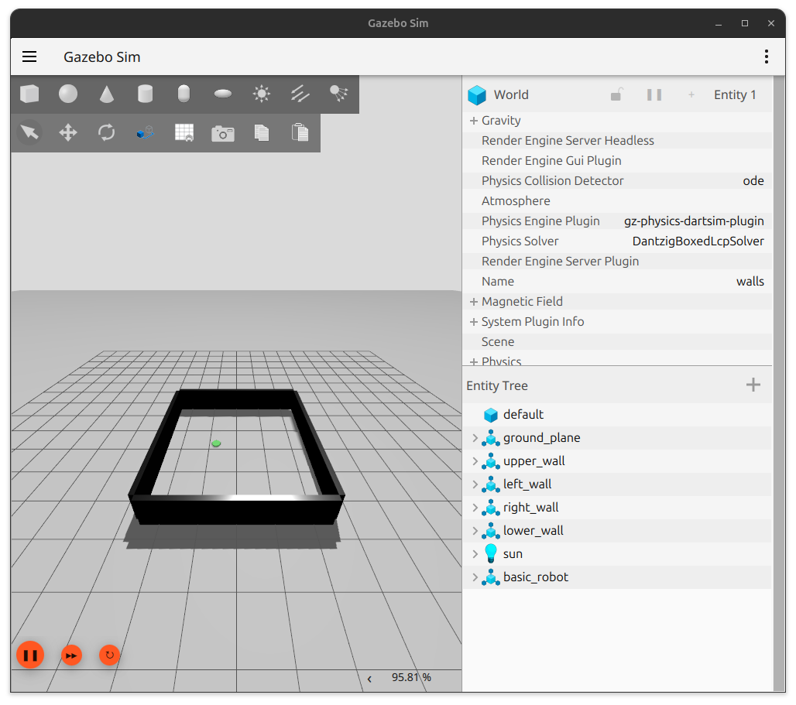
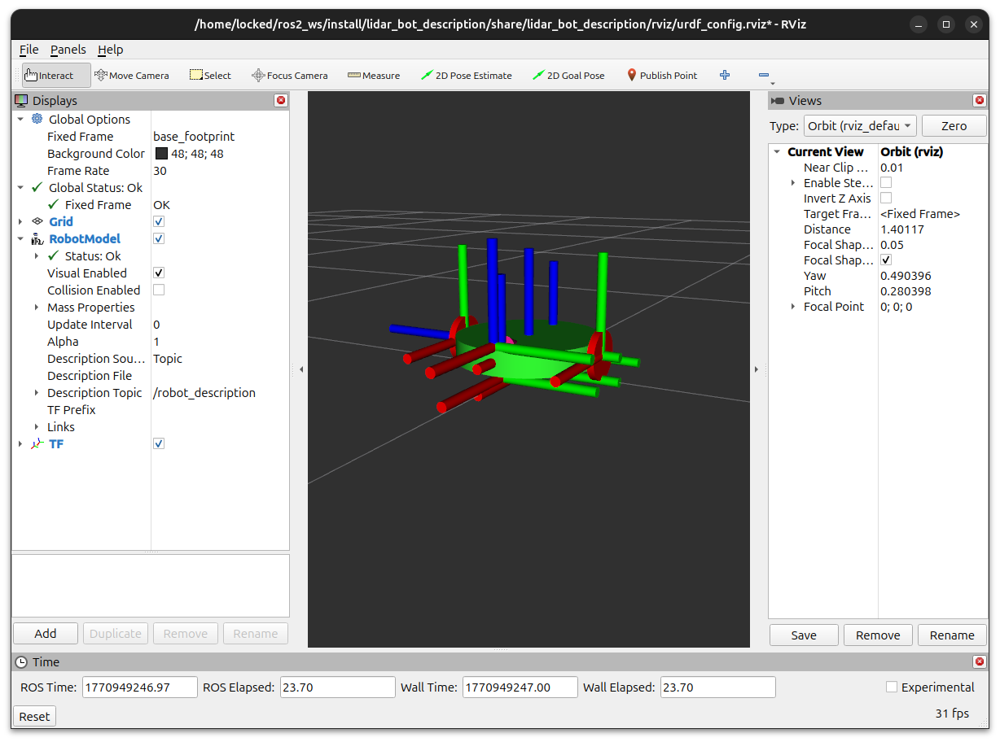

# PID Controller Robot (January 2026)

This project extends the original [PID‑based obstacle‑avoidance controller](https://github.com/JMunoz610/WallFollowingPID) by migrating the entire system from ROS2 + Stage to a full ROS2 + Gazebo simulation environment. The goal was to understand the architecture, tooling, and workflow required for realistic 3D simulations with physics, enabling more complex scenarios than 2D Stage could support. The robot still relies on laser scan data and a PID loop for steering decisions, but the upgraded setup provides a richer, more accurate foundation for future high‑fidelity experiments.

---

## Layout of Everything

### lidar_bot_bringup
- config: bridge between Gazebo and ROS2.
- launch: gazebo launch file (launches gazebo and rviz) and rviz launch file.
- worlds: contains the gazebo world.

### lidar_bot_control
- src: contains random_walk.cpp and wall_following.cpp.

### lidar_bot_description
- rviz: contains the rviz configuration file.
- urdf: contrains the robot's urdf.

## Running the wall_following algorithm

To launch the gazebo world with the robot:

```bash
ros2 launch lidar_bot_bringup gazebo.launch.xml
```
<p align="center">
  
  
</p>

<p align="center">
  Figure 1: Images of gazebo (left) environment and rviz (right) after running command.
</p>

In a separate terminal launch the wall_following.cpp file.

```bash
ros2 run lidar_bot_control wall_following.cpp
```

## Running the random_walk algorithm

To launch the gazebo world with the robot:

```bash
ros2 launch lidar_bot_bringup gazebo.launch.xml
```

In a separate terminal launch the random_walk.cpp file.

```bash
ros2 launch lidar_bot_control random_walk.cpp
```

